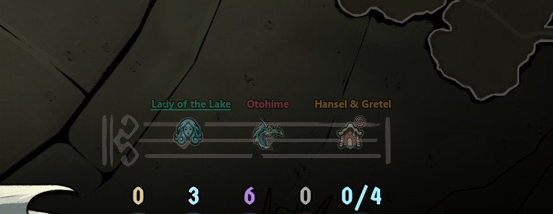
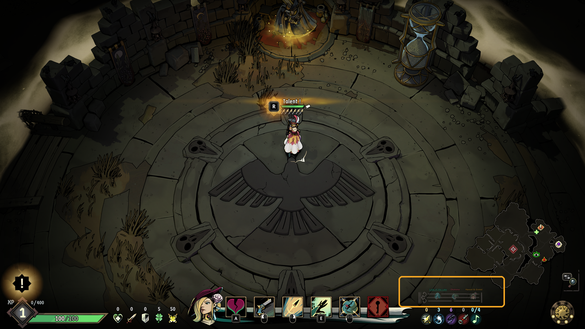

# Ravenswatch Melody Overlay

See **all three Melodies of your run** the moment it starts — including the ones
you haven't unlocked yet.

## Why you'd want this

Each Ravenswatch run rolls **3 of the game's 12 Melodies**, but the game only
reveals them one at a time: you collect Notes (Magical Harps in Thieves' Stashes,
Reverie chests, killing Stingy Jack) to unlock the first Melody, then more Notes
for the second, then the third — never knowing what's coming next.

This overlay shows the full trio from the first second of the run.

### Hunting *Symphony of Reverie* (owned by 0.1% of players)

*Discover all the Melodies* is the **rarest achievement in the game** — 0.1%
global unlock rate on Steam. With 12 Melodies and only 3 per run, you can grind
Notes deep into a run just to discover it never contained a Melody you were
missing. With the overlay, you know instantly:

> Run starts → trio contains a Melody you're missing → **play it out.**
> Nothing new → **abandon and reroll.** Ten seconds per check instead of an hour.

### Seed hunting & tool-assisted runs

The Melody trio is part of the run seed. If you're hunting a specific setup —
say **Fairy Godmother first** (4 notes, instant level up) for a speedrun route —
the overlay turns seed hunting into *restart → glance → keep or reroll*, a few
seconds per attempt. Same for verifying a known seed before a tool-assisted or
showcase run: the trio confirms you're on the right roll before you've taken a
single step.

## Reading the overlay

In the screenshot above, the run rolled (left to right = unlock order):

1. **Lady of the Lake** — green = 4 notes — underlined = currently active
2. **Otohime** — red = 6 notes
3. **Hansel & Gretel** — orange = 5 notes

Color is the note cost: **green = 4, orange = 5, red = 6**. The overlay fades in
over the melody staff at the bottom-right of the HUD, only while you're in a run:

## Download

Grab `RavenswatchOverlay.exe` from the **[latest release](../../releases/latest)**.

## How to use

1. Double-click `RavenswatchOverlay.exe`
2. Accept the admin prompt (the overlay reads melody data from the game's memory,
   which requires admin rights)
3. That's it. Start Ravenswatch whenever — once you're in a run, the melodies
   fade in over the HUD staff. The overlay hides in the lobby and closes itself
   when you quit the game.

## Good to know

- **Windows only.** Tested at 1440p/2160p borderless fullscreen; sizes scale with
  the game window.
- **Game updates can break it.** Melody detection depends on the current Steam
  build of Ravenswatch. If a patch breaks it, the overlay simply shows nothing —
  check back here for an updated release.
- **SmartScreen warning:** the exe is unsigned, so Windows may show
  "Windows protected your PC" — click *More info* → *Run anyway*. Some antivirus
  tools flag packed exes as suspicious; that's a false positive.
- **Display-only.** The window is click-through and never takes focus — it can't
  interfere with your inputs. It only *reads* process memory (like an
  autosplitter) and touches no game files.
- **Fair-play note:** this reveals information the game intentionally hides.
  Fine for achievement grinding, seed hunting, and tool-assisted/showcase
  content — your call whether it belongs in unassisted runs.
